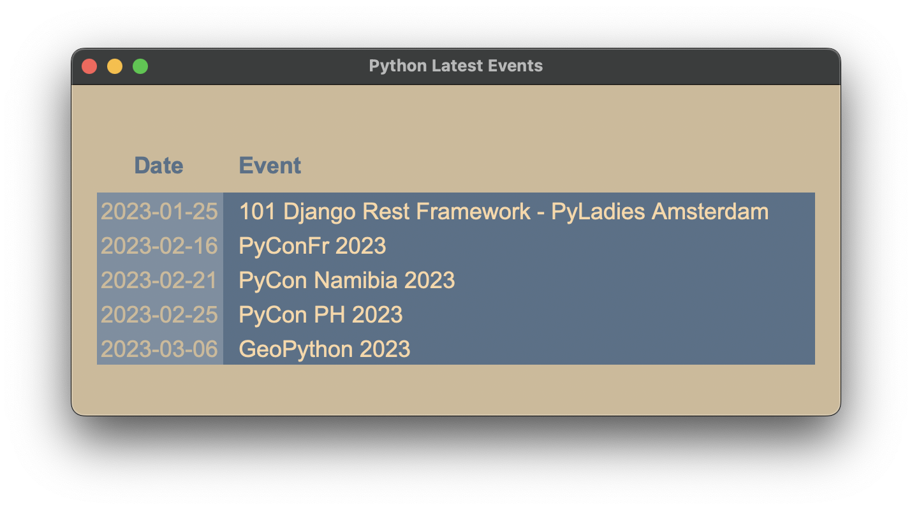

# Python Event Horizon

Welcome to Python Event Horizon, a project that uses the tkinter and selenium modules to find the latest python events and display them in a GUI window - created with the tkinter library!

## Getting Started

### Prerequisites

* [Python 3.X](https://www.python.org/)
* [tkinter](https://docs.python.org/3/library/tkinter.html)
* [Selenium](https://pypi.org/project/selenium/)

### Installing

Clone or download the repository, then install the dependancies.

```
git clone https://github.com/user/python-event-horizon
cd python-event-horizon
pip install -r requirements.txt
```

## Usage

Run the program:

`python main.py`

The program begins by initializing and configuring the root window to give it a title and background color. Then, it uses a selenium webdriver to navigate to the python homepage in order to extract the desired data. Labels are then set up for the date and the event, with grid positions and formatting. A for loop is then used to navigate the XPath to grab the latest five python events, and then append the labels to the root window with the desired data, along with configurations for font, anchor, background color etc. Finally, the webdriver is closed and the root window is executed. 

## Built With

* [tkinter](https://docs.python.org/3/library/tkinter.html) - GUI library
* [Selenium](https://pypi.org/project/selenium/) - Web driver automation

## Contributing

Pull requests are welcome. For major changes, please open an issue first to discuss what you would like to change.

## License

[MIT](https://choosealicense.com/licenses/mit/)

